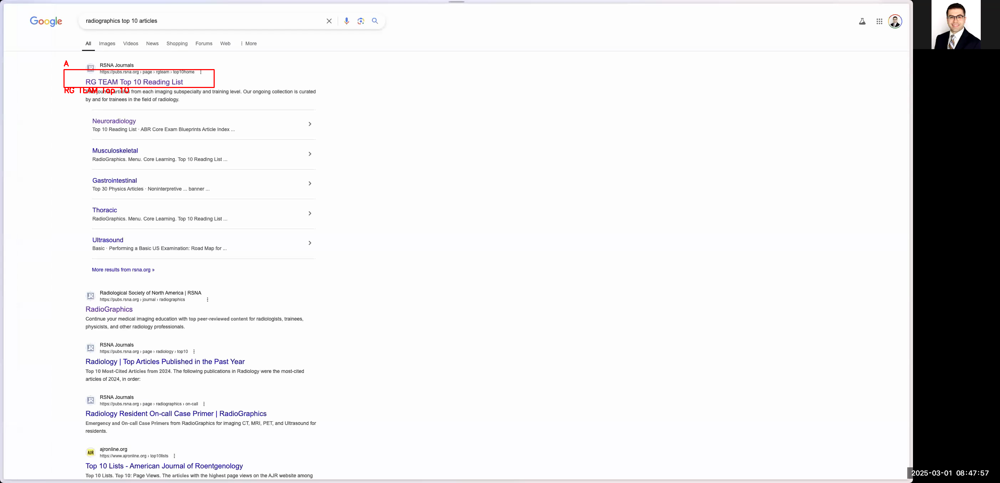
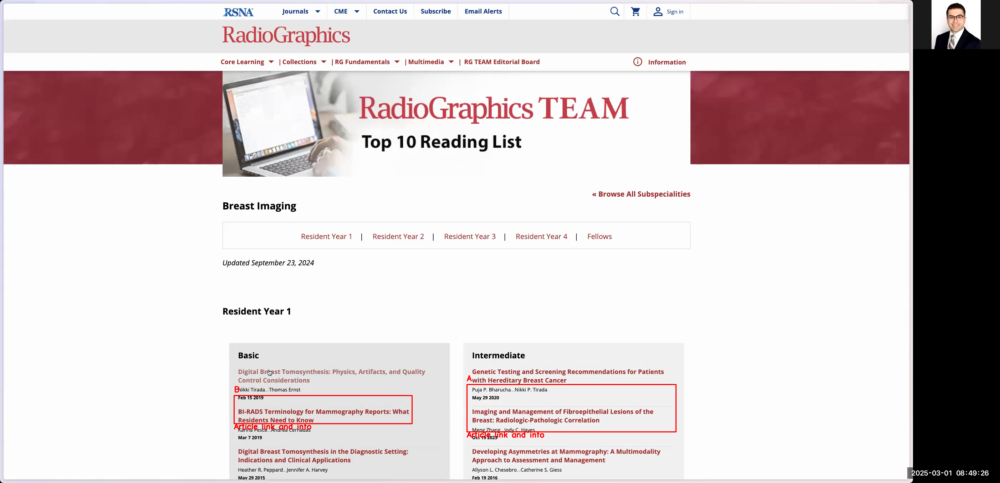
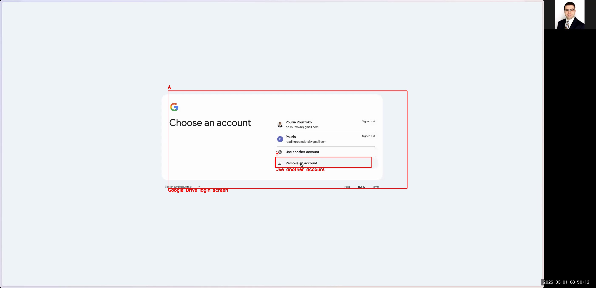
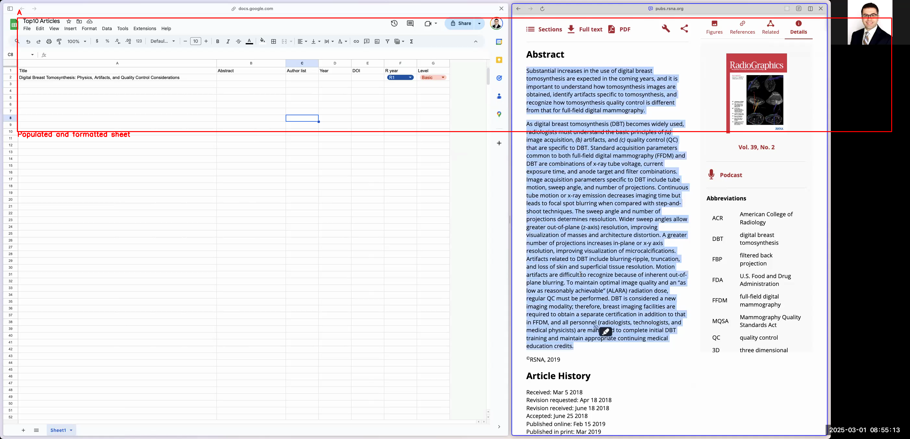

# How to Chart Radiographics Top 10 Articles in Google Sheets

This guide explains how to automatically chart all the Radiographics Top 10 articles in a Google Sheet. The process includes navigating the Radiographics website, extracting article details such as title, authors, abstract, DOI, year, residency year, and article level, and organizing this data in a well-formatted Google Sheet that can later be used in a Python program or any other application.

# # Introduction

In this guide, you will learn how to:

- Navigate to the Radiographics website and find the Top 10 articles list
- Drill down into article categories and open individual article pages
- Extract key article details (title, author, DOI, year, residency year, level, and abstract)
- Log into Google Drive, create a new folder and a Google Sheet
- Set up the Google Sheet with proper column headers
- Use drop-down menus and text formatting in Google Sheets to ensure a clean and organized appearance
- Paste and clean up article abstracts and other text information

Follow the step-by-step instructions below.

# # Step-by-Step Instructions

## # 1. Open the Radiographics Top 10 Articles Page

1. Open your web browser and go to your preferred search engine (e.g., Google).
2. Type in "Radiographics Top 10 Articles" and press Enter.
3. From the search results, click on the link labeled "RG TEAM Top 10 Reading List".

```

```



4. The Radiographics website for the top 10 articles will load. You will see various categories of articles arranged by residency years.

```

```


## # 2. Drill Down Into a Specific Category and Open an Article

1. Click on any category of your choice (for example, "Breast Imaging").
2. You will see a list of articles sorted by residency years (e.g., R1, R2) and levels (e.g., basic, intermediate).
3. Click on an article (e.g., one under the basic category for R1 residents).

```

```



*Note: The full link of the article may not be accessible, but you only need the visible details for charting purposes.*

## # 3. Log Into Google Drive and Set Up Your Workspace

1. Open a new browser tab and navigate to `https://drive.google.com`.
2. If you are not already logged in, enter your Google account credentials. (Depending on your setup, you might need to use a specific email or passphrase.)

```

```



## # 4. Create a New Folder for Your Project

1. In Google Drive, click on the "New" button and select "Folder".
2. Name the new folder (e.g., `RG-Top10-Articles`).
3. Open the newly created folder.

```

```


## # 5. Create a New Google Sheet and Set It Up

1. Inside the new folder, click on the "New" button again and choose "Google Sheets" > "Blank spreadsheet".
2. Rename the spreadsheet to `Top10-Articles`.
3. In the first row of the Google Sheet, add the following column headers:
- A1: Title
- B1: Author List
- C1: DOI
- D1: Year
- E1: R Year
- F1: Level
- G1: Abstract

```

```


## # 6. Set Up Drop-Down Menus and Text Formatting

1. For the "R Year" column (column E), create a drop-down menu:
- Right-click on cell E2 and select "Data validation".
- Choose "List of items" as the criteria and enter: `R1, R2, R3, R4`.
- (Optional) Set each value to have distinct colors if desired using the formatting tools.
2. For the "Level" column (column F), create a drop-down with possible values (e.g., Basic, Intermediate, Advanced).

```

```


3. Adjust text wrapping:
- Ensure that cells (especially the Abstract column) are formatted to wrap text if necessary, or specifically set not to wrap if that suits your data cleaning preferences.

## # 7. Populate the Google Sheet With Article Data

For each article on the Radiographics page, follow these steps:

1. Switch to the browser tab with the article page (or use a split-screen setup with the Google Sheet visible).
2. Copy the article title and paste it into the Title column (e.g., cell A2).
3. Copy the author list from the article page and paste it into the Author List column (e.g., cell B2). To remove any extra spaces or hidden characters:
- Option A: Paste directly and then manually remove extra spaces.
- Option B: Paste into your browser's address bar and then copy and paste back into the spreadsheet.
4. Copy the article's DOI (which is a link) and paste it into the DOI column (e.g., cell C2).
5. Manually type or extract the publication year (e.g., `2019`) and paste it into the Year column (e.g., cell D2).
6. Use the drop-down in the "R Year" column (cell E2) to assign the residency year (e.g., R1).
7. Use the drop-down in the "Level" column (cell F2) to select the article’s level (e.g., Basic).
8. Copy the article abstract and paste it into the Abstract column (e.g., cell G2). Use the text cleaning trick:
- Paste the abstract into your browser's address bar to remove unwanted formatting and extra spaces, then copy the cleaned text and paste it into the spreadsheet.

```

```


## # 8. Repeat for All Articles

1. Return to the Radiographics website and navigate through each article category (e.g., different residency years, levels, and topics).
2. Repeat the data extraction and entry process for every article until all desired articles are charted in the Google Sheet.
3. Once completed, remove any unnecessary rows to keep the spreadsheet neat.

## # 9. Finalize and Beautify the Spreadsheet

1. Review the sheet to ensure all data is correctly entered and formatted. Bold the titles or apply any additional styling to improve readability.
2. Confirm that drop-downs are working as expected and that no extra spaces or unwanted characters remain.
3. Notify your intended audience (or simply note to yourself) that the Google Spreadsheet is ready for use in any further processing (e.g., within a Python program).

```

```



# # Conclusion

By following these steps, you will have successfully charted all Radiographics Top 10 articles in a Google Sheet. This guide provides detailed instructions for navigating the website, extracting necessary information, and organizing it in a structured, accessible format. The end result is a clean spreadsheet ready for further analysis or integration into your projects.

If you have any questions or need further clarification, feel free to ask!