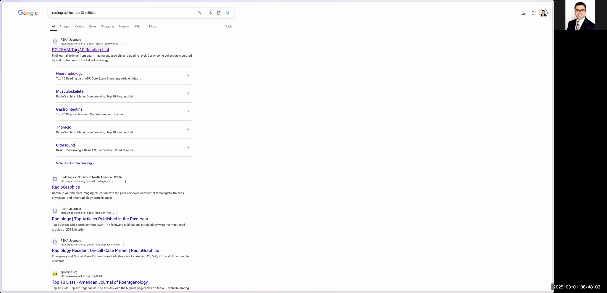
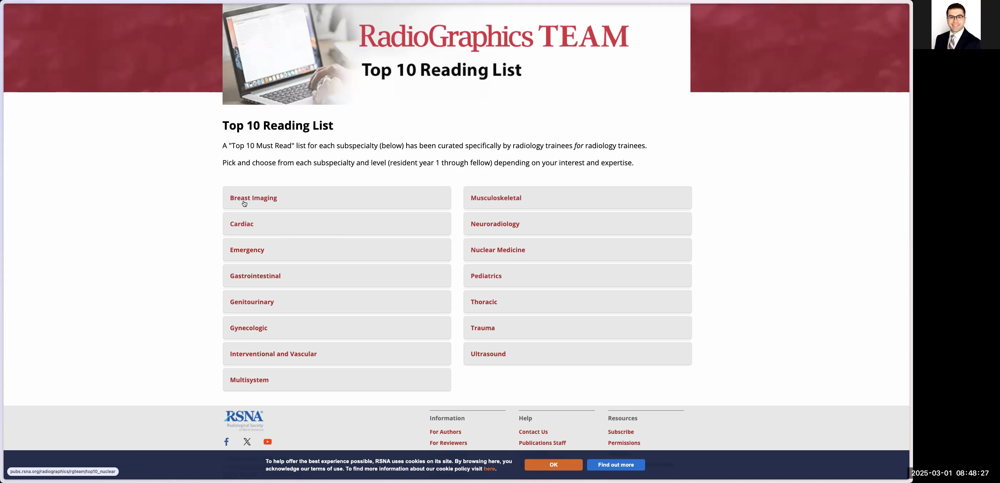
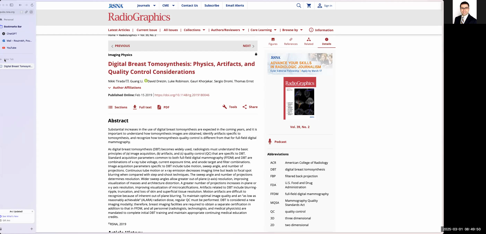
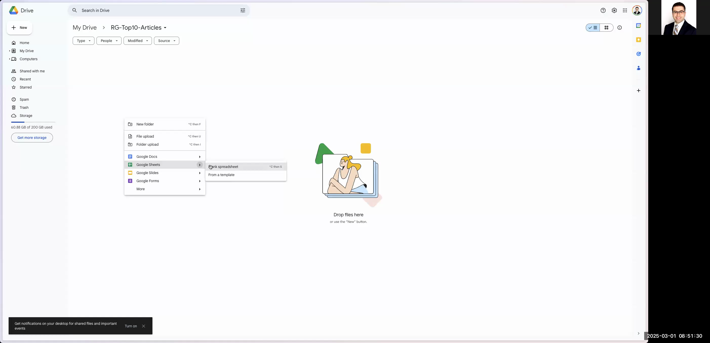
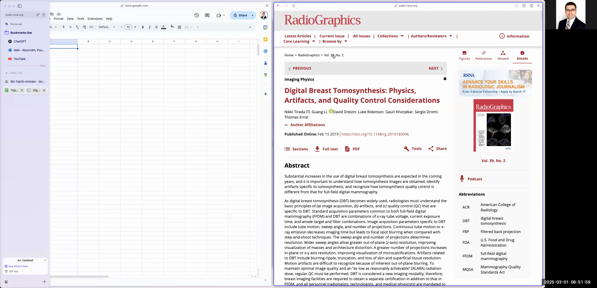

# How to Chart Radiographics Top 10 Articles into a Google Spreadsheet

This guide explains how to chart articles from the Radiographics Top 10 Reading List into a Google Spreadsheet. By following these steps, you’ll be able to extract key details such as titles, authors, publication year, DOI, residency year, and article level from the Radiographics website and organize them in a neatly formatted Google Sheet that can later be processed with Python.

# # Introduction

In this tutorial, you will:

- Navigate to the Radiographics Top 10 Articles page using a Google search.
- Select a category (e.g., Breast Imaging) and review the list of articles, divided by residency year and article level.
- Open Google Drive, create a dedicated folder, and set up a Google Spreadsheet to record article details.
- Extract and paste article information such as title, author list, year, DOI, abstract, residency year, and level.
- Format the spreadsheet by adding dropdown menus for residency year and article level, applying text wrapping or removal of extra characters where needed.
- Tidy up the spreadsheet by removing unnecessary rows or columns to ensure it looks neat and is ready for further processing.

Follow the detailed step-by-step instructions below.

# # Step-by-Step Instructions

## # 1. Access the Radiographics Top 10 Articles Page

1. Open your web browser.
2. In the address bar, type a search query like "Radiographics Top 10 Articles".
3. From the Google search results, click on the link labeled "RG TEAM Top 10 Reading List".

```


```


4. Once the page loads, you will see multiple categories (e.g., Breast Imaging, Cardiac, etc.) along with various residency years and paper levels (Basic, Intermediate, Advanced).

```


## # 2. Select an Article Category

1. Click on one of the article categories (for example, Breast Imaging).
2. Scroll through the list to review the articles available. Notice that each residency year (e.g., R1) may contain several subcategories such as Basic, Intermediate, or Advanced.

```




## # 3. Extract Article Information

For each article you wish to chart, you will need to extract several key details:

- **Title**: The topic or title of the article.
- **Author List**: Names of the authors.
- **Year**: The publication year (e.g., 2019).
- **DOI**: A DOI link (if available).
- **Residency Year (R Year)**: For example, R1, R2, etc. 
- **Level**: The article level, such as Basic, Intermediate, Advanced.
- **Abstract**: A summary of the paper (optional but recommended for further processing).

**Tip:** When copying text (for example, the abstract or author list), first paste it into your browser's address bar to remove extra spaces or formatting issues, then copy it again before pasting into the spreadsheet.

## # 4. Prepare Your Google Drive Workspace

1. Open a new browser tab and navigate to [Google Drive](https://drive.google.com).
2. Sign in to your Google account. If you need to use a different account, enter the corresponding email (e.g., pioruzroj@gmail.com) and follow the login instructions.

```


3. Once logged in, create a new folder by clicking the '+ New' button, then choose 'Folder'. Name the folder (for example, "rg-top10-articles").

```




4. Open the new folder and create a new Google Spreadsheet. Name it accordingly (e.g., "Top10-Articles").

```


## # 5. Set Up Your Spreadsheet

1. In your spreadsheet, define columns for each piece of information to be recorded. For example, create the following headers in the top row:
- Title
- Author List
- Year
- DOI
- R Year
- Level
- Abstract

2. Format the spreadsheet to improve readability:
- Remove unnecessary columns that might have been created by default.
- Apply text wrapping for cells that may contain long text (except where explicitly undesired, such as with the abstract if you prefer a single-line view).

```




## # 6. Create Dropdown Menus for Consistent Data Entry

1. **For the 'Level' Column:**
- Click on the column header for the Level column.
- Choose Data > Data validation.
- Select 'List of items' and enter: Basic,Intermediate,Advanced (separate by commas).
- Optionally, assign background colors for each option to enhance visual clarity.
- Click Save.

2. **For the 'R Year' Column:**
- Similarly, click on the R Year column header.
- Choose Data > Data validation.
- Enter the list of residency years (e.g., R1,R2,R3,R4) as items.
- You can assign distinct colors for these options as well.
- Click Save.

```


## # 7. Populate the Spreadsheet with Article Data

For each article in your selected category:

1. Navigate to the article’s page and copy the title. Paste it into the appropriate cell under the Title column.
2. Copy the author list. To remove extra formatting, paste it into your browser’s address bar first, then copy from there and paste into the Author List cell.
3. Record the publication year in the Year column (e.g., 2019).
4. Copy the DOI link (if available) and paste it into the DOI column.
5. Set the R Year by selecting the appropriate value from the dropdown menu you created (e.g., R1).
6. Similarly, set the Level (e.g., Basic) by using the corresponding dropdown menu.
7. Copy the abstract from the article page. If necessary, use the browser’s address bar trick (paste then copy again) to remove any extra spaces or formatting. Paste it into the Abstract column.

```


Repeat the above process for each article in the category. If there are multiple categories (like Cardiac, Emergency, etc.), repeat the extraction and data entry process accordingly.

## # 8. Finalize and Tidy Up the Spreadsheet

1. Review your spreadsheet and delete any extra rows or columns that are not required. This step is important to ensure the sheet is visually neat and ready for further processing.
2. Optionally, enhance the appearance by formatting the headers (e.g., bold them) or applying additional cell styles.
3. Once completed, notify yourself (or the end user) that the spreadsheet is fully prepared and ready to be loaded into your Python project or any further application.

```


## # 9. Summary

You have now learned how to:

- Locate and navigate the Radiographics Top 10 Articles website.
- Select the appropriate article category and extract key metadata.
- Use Google Drive and Google Sheets to chronicle the extracted data in an organized format.
- Use Google Sheet’s data validation to create dropdown menus ensuring consistency in data entry.
- Clean up text data to remove unwanted formatting and extra spaces.
- Prepare a neat and organized spreadsheet that is ready for further automated processing.

This process can be automated or manually replicated whenever new data needs to be charted.

Happy charting!