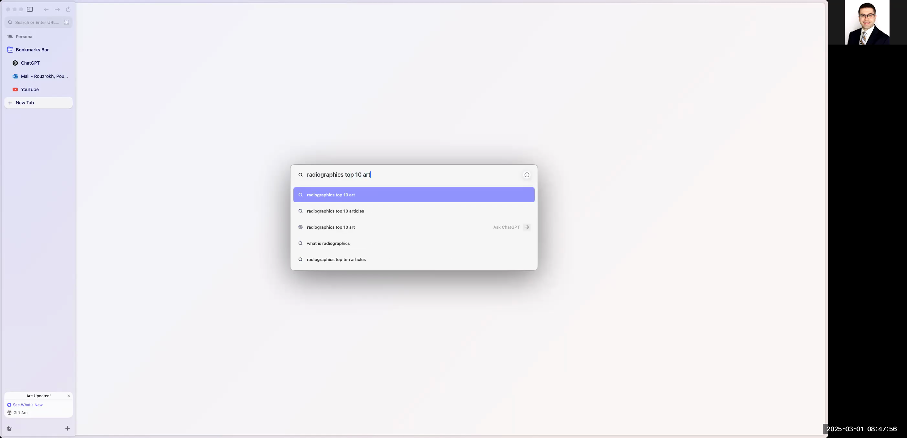

# Automated Cataloging of Radiographics Top 10 Articles in Google Sheets

This guide explains how to automatically extract bibliographic data from the Radiographics website's top 10 articles and organize it in a Google Sheets document. The steps below walk you through accessing the website, extracting data such as the article title, authors, DOI, year, residency year, level, and abstract, and finally setting up a polished, formatted spreadsheet that can later be used for further processing (e.g., with Python scripts).

# # Table of Contents

1. [Accessing the Radiographics Website](#1-accessing-the-radiographics-website)
2. [Navigating the Article Categories](#2-navigating-the-article-categories)
3. [Logging into Google Drive](#3-logging-into-google-drive)
4. [Creating a New Folder and Sheet in Google Drive](#4-creating-a-new-folder-and-sheet-in-google-drive)
5. [Setting Up Your Google Sheet](#5-setting-up-your-google-sheet)
6. [Extracting and Pasting Article Data](#6-extracting-and-pasting-article-data)
7. [Enhancing Data Integrity and Formatting](#7-enhancing-data-integrity-and-formatting)
8. [Finalizing Your Spreadsheet](#8-finalizing-your-spreadsheet)

---

# # 1. Accessing the Radiographics Website

1. Open your preferred web browser.
2. In the search bar, type "radiographics top 10 articles".
3. Locate and click on the first result titled "RG TEAM Top 10 reading list". This page displays the curated list of Radiographics articles.

```

```



---

# # 2. Navigating the Article Categories

1. Once on the Radiographics page, review the list of article categories (e.g., Breast Imaging, Cardiac, Musculoskeletal, etc.).
2. Notice that articles are grouped by residency years and levels (e.g., basic, intermediate, advanced).
3. Click on one of the categories (for example, "Breast Imaging") to display the articles under that category.

```

```


---

# # 3. Logging into Google Drive

1. Open a new tab in your browser and navigate to `https://drive.google.com`.
2. If you are not already logged in, sign in using your designated Google account. (If prompted, use your email and follow the on-screen instructions such as entering your passkey or password.)
3. Ensure that you are signed in and have full access to create files and folders on your Google Drive.

```

```


---

# # 4. Creating a New Folder and Sheet in Google Drive

1. In Google Drive, click on the **New** button and select **Folder**.
2. Name the folder (for example, `RG-Top10-Articles`).
3. Open the newly created folder by double-clicking it.
4. Inside the folder, click on **New** again and choose **Google Sheets** to create a new blank spreadsheet.
5. Rename the spreadsheet to `Top 10 Articles`.

```


```


---

# # 5. Setting Up Your Google Sheet

1. In the newly created spreadsheet, set up the following column headers in the first row:
- Title
- Author List
- DOI
- Year
- R Year (Residency Year)
- Level
- Abstract
2. Optionally, adjust the column widths and text alignment to ensure a clean layout.

```

```


---

# # 6. Extracting and Pasting Article Data

For each article on the Radiographics website, follow these steps:

1. **Copy the Article Title:**
- Highlight the title of the article on the Radiographics page.
- Copy the title and paste it into the corresponding cell under the "Title" column in your Google Sheet.

2. **Copy Other Data (Author List, DOI, Year, etc.):**
- For the author list and DOI, highlight the text on the page, then copy it.
- If the copied text includes extra spaces or special characters, paste it first into your browser's address bar to cleanse the text before copying it again into the sheet.

3. **Extract Additional Information:**
- Copy the abstract of the article and paste it under the "Abstract" column. Use the address bar trick as needed to remove formatting issues (like extra line breaks or spaces).
- Enter the year of publication manually (for example, `2019`).
- Populate the "R Year" column by selecting the correct residency year from the drop-down list (this will be set up in the next step).
- For the "Level" column, input the appropriate classification (e.g., Basic, Intermediate, or Advanced) using the dropdown feature.

```

```


---

# # 7. Enhancing Data Integrity and Formatting

1. **Setting Up Dropdown Menus:**
- For the **Level** column, set up a dropdown menu with these options:
- Basic
- Intermediate
- Advanced
- In Google Sheets, this can be accomplished by selecting the column, clicking on **Data > Data validation...**, choosing **List of items**, and entering the options separated by commas.

2. **Assigning Colors to Dropdown Options:**
- Optionally, add color coding to the dropdown selections (e.g., assign a specific color to each level) to improve visual clarity.

3. **Residency Year Dropdown:**
- Similarly, create a dropdown menu for the **R Year** column with options such as `R1`, `R2`, `R3`, and `R4`. Apply colors if desired to differentiate the residency levels.

4. **Cleaning Up Data:**
- Remove any extra columns that are not needed to keep the spreadsheet clean.
- Bold the column headers or article titles as necessary to enhance readability.

```

```


---

# # 8. Finalizing Your Spreadsheet

1. After all articles have been processed and entered into the Google Sheet using the steps above, perform a final review:
- Check that each row corresponds to a single article and that all fields (Title, Author List, DOI, Year, R Year, Level, Abstract) are correctly filled in.
- Remove any unused rows to keep the spreadsheet tidy.
- Adjust any formatting settings, such as text wrapping in the abstract column, to ensure that the data is clearly visible and uniform.
2. Notify the end user or your project team that the data collection is complete and the Google Sheet is ready for further processing (e.g., integration with Python programs).

```

```


---

# # Conclusion

Following these steps, you should now have a complete and well-organized Google Sheet cataloging the Radiographics top 10 articles. This structured spreadsheet is suitable for further analysis or integration with your Python projects. If you encounter any issues during the setup process, review the respective section in this guide and verify each step for accuracy.

Happy cataloging!