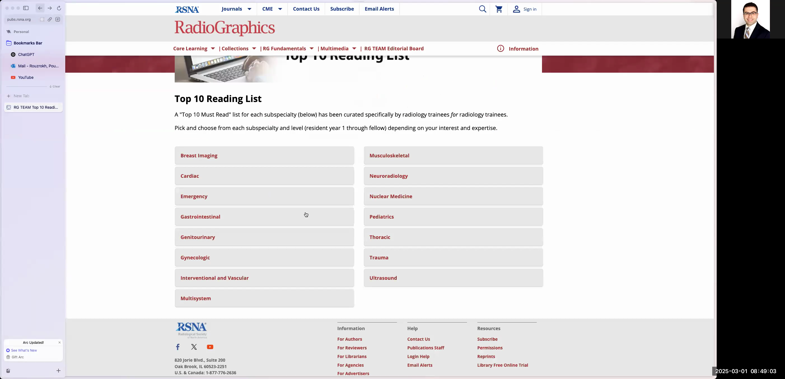
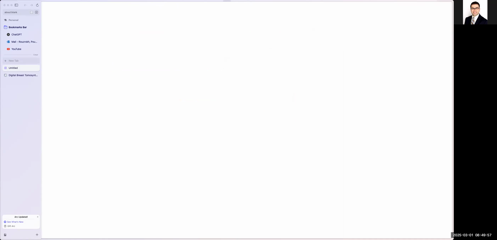
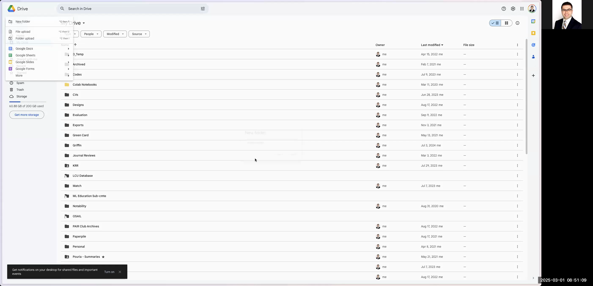
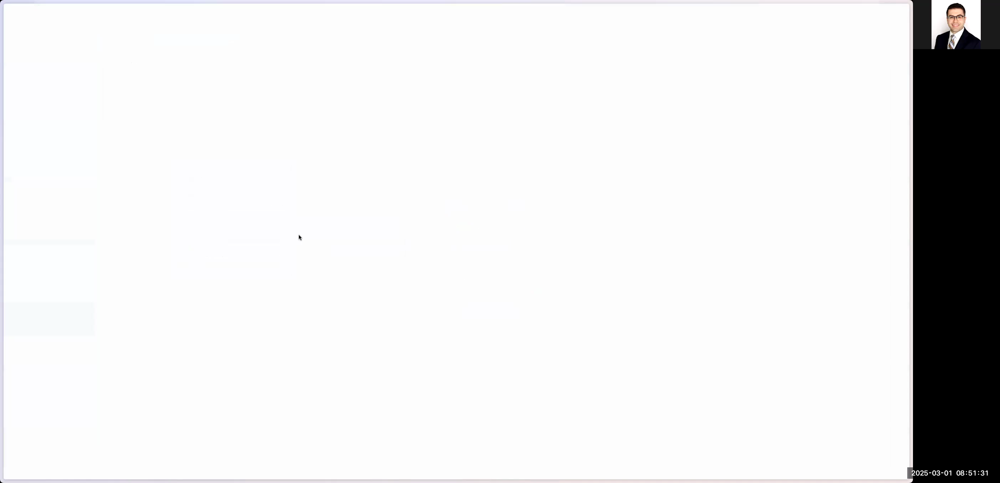

# Automating the Charting of Radiographics Top 10 Articles into a Google Spreadsheet

This guide details how to automatically chart Radiographics' top 10 articles from their website into a Google Spreadsheet. By following these steps, you will learn how to navigate the Radiographics website, extract key article information, set up your Google Drive workspace, and populate the spreadsheet with formatted data for further processing in Python or other applications.

---

# # Introduction

In this guide, you will:

- Search for and navigate to the Radiographics top 10 articles page.
- Select a category (e.g., Breast Imaging, Cardiac) and view the list of articles specific to residency years.
- Extract details such as the article title, author list, publication year, DOI link, and abstract from each article.
- Log in to Google Drive, create a dedicated folder, and set up a new Google Sheets spreadsheet.
- Configure the spreadsheet with appropriate headers, dropdown menus, text wrapping, and colors to improve readability and ease further automatic processing.

By the end of this process, you will have a well-organized Google Spreadsheet containing all the relevant data from the Radiographics top 10 articles.

---

# # Step-by-Step Instructions

## # 1. Navigate to the Radiographics Top 10 Articles Page

1. Open your preferred web browser.
2. In the search bar, type "Radiographics top 10 articles" and press Enter.
3. Look through the search results and click on the link labeled **RG TEAM Top 10 Reading List** (this is the official page with all the categorized articles).

```

```


4. Once the page loads, use your mouse or zoom function to clearly view the different categories and residency years (e.g., Breast Imaging, Cardiac, etc.).

```

```



---

## # 2. Selecting an Article Category and Viewing Article Details

1. Click on any article category (for example, **Breast Imaging**).
2. The page will display articles arranged by residency year and categorized by levels (e.g., Basic, Intermediate, Advanced).
3. Click on an individual article (for example, one from the Basic category for R1 residents) to view its details.
4. On the article page, note the following information that you will record:
- **Title** of the article
- **Authors** (author list)
- **Publication Year** (e.g., 2019)
- **DOI URL** (copy the hyperlink as is)
- **Abstract** (use the browser's address bar trick to remove any extra formatting characters if necessary)
- **Residency Year (R1, R2, etc.)** and **Article Level (Basic, Intermediate, Advanced)**

```

```


---

## # 3. Setting Up Your Google Drive Workspace

1. Open a new browser tab and go to [https://drive.google.com](https://drive.google.com).
2. Ensure you are logged in using your desired Google account. (If you see a login prompt or multiple accounts, follow the on-screen instructions to use the correct account or enter your credentials.)

```

```



3. Inside Google Drive, click on the **New** button and choose **Folder**.
4. Name the folder something recognizable such as `RG-Top10-Articles`.

```

```



5. Open the newly created folder by double-clicking on it.
6. Inside the folder, click on **New** and then select **Google Sheets** to create a new blank spreadsheet.
7. Name the spreadsheet `Top 10 Articles`.

```

```



---

## # 4. Configuring the Spreadsheet

1. In the first row of the spreadsheet, create the following header columns with these suggested titles (you may adjust the order if needed):
- Title
- Author List
- Year
- DOI
- R Year
- Level
- Abstract

2. Format each header cell as bold to visually separate them from the data rows.
3. Adjust the width of each column so that the content is easily legible.
4. For columns like **Level** and **R Year**, set up a dropdown list using data validation:
- For **Level**, add options such as `Basic`, `Intermediate`, and `Advanced` and use contrasting colors if desired.
- For **R Year**, add options like `R1`, `R2`, `R3`, and `R4` and consider color coding them for extra clarity.

```

```


---

## # 5. Populating the Spreadsheet with Article Data

For **each article** from the Radiographics page, perform the following steps:

1. **Extract and Record the Title**
- Copy the title of the article from the article page.
- Paste it into the appropriate cell under the *Title* column in your spreadsheet.

2. **Extract and Record the Author List**
- Copy the author list from the article page. To avoid extra spaces or line breaks, paste it into the browser's address bar temporarily, then copy it again and paste into the spreadsheet under the *Author List* column.

3. **Extract and Record the Publication Year**
- Manually type or copy the publication year (e.g., 2019) into the *Year* column.

4. **Extract and Record the DOI Link**
- Copy the DOI link from the article page and paste it into the *DOI* column. This link is clickable and should remain as a URL.

5. **Set the Residency Year and Level**
- In the *R Year* column, select the appropriate residency year from your dropdown (e.g., R1).
- In the *Level* column, select the corresponding article level (e.g., Basic, Intermediate, or Advanced) from the dropdown menu you created.

6. **Extract and Record the Abstract**
- Copy the article's abstract. If the abstract contains extra formatting (line breaks or unwanted characters), paste it first in the address bar of your browser to remove these extra characters, then copy it again.
- Paste the cleaned abstract into the *Abstract* column. Adjust text wrapping settings if needed:
- Ensure text wrapping is enabled so that the full abstract is visible without overflowing the cell.
- If a shorter abstract view is desired, change the text wrapping to a shorter preset or disable it if necessary.

```

```

7. Repeat steps 1 through 6 for every article listed on the Radiographics page. For categories with multiple residency levels or multiple articles per category, ensure you extract and correctly input each article’s data.

---

## # 6. Final Spreadsheet Touches

1. Once all articles have been charted, remove or delete any extra empty rows to keep the spreadsheet uncluttered.
2. Double-check the spreadsheet for consistency:
- Ensure all cells are visually aligned.
- Confirm that dropdown menus are correctly applied in the *R Year* and *Level* columns.
- Verify that text wrapping is enabled or disabled as per your visual preference, especially in the *Abstract* column.
3. Optionally, use cell formatting (like bolding titles or applying background colors) to enhance the visual appeal of the spreadsheet.
4. Save your changes. Your Google Spreadsheet is now ready for further processing or integration into your Python projects.

```

```

---

# # Conclusion

By following this guide, you have successfully navigated the Radiographics website, extracted key details about the top 10 articles, and organized the data in a structured Google Spreadsheet. This setup not only streamlines manual data entry but also paves the way for automated processing in future Python projects or other applications.

Happy charting!