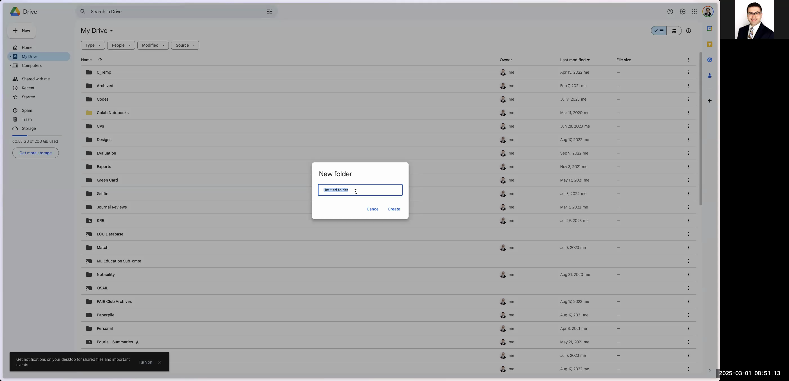

# Charting Radiographics Top 10 Articles into a Google Spreadsheet

This guide explains how to automatically chart articles from the Radiographics Top 10 Reading List into a Google Spreadsheet. You will learn how to navigate the Radiographics website, extract key details for each paper, and organize them in a well-formatted Google Sheet that can later be used in Python programs or other applications.

---

# # Table of Contents

1. [Access the Radiographics Website](#1-access-the-radiographics-website)
2. [Select a Category and Article](#2-select-a-category-and-article)
3. [Log In to Google Drive](#3-log-in-to-google-drive)
4. [Create a New Folder and Spreadsheet](#4-create-a-new-folder-and-spreadsheet)
5. [Set Up Your Spreadsheet](#5-set-up-your-spreadsheet)
6. [Extract and Enter Article Data](#6-extract-and-enter-article-data)
7. [Finalize and Format Your Spreadsheet](#7-finalize-and-format-your-spreadsheet)

---

# # 1. Access the Radiographics Website

1. Open your web browser.
2. In the search bar, type **"Radiographics top 10 articles"**.
3. From the Google search results, click on the link labeled **"RG Team Top 10 Reading List"**. This is the target page containing various article categories.

```

```


---

# # 2. Select a Category and Article

1. Once the Radiographics Top 10 page loads, you will see several article categories (e.g., Breast Imaging, Cardiac, etc.) along with subdivisions by residency year and article level (basic, intermediate, advanced).
2. Click on any category that interests you (for example, **"Breast Imaging"**). This will display a list of articles under a specific residency year (e.g., R1).
3. Choose an article from the list. Note that you might see that the full article link isn’t directly accessible – this is acceptable as your focus is on charting article details.

```

```


---

# # 3. Log In to Google Drive

1. Open a new browser tab and go to [https://drive.google.com](https://drive.google.com).
2. Log in to your Google account. Note that if you are not already signed in or need to use a different account, select the appropriate account or enter your credentials.
3. Follow any prompts (passkeys, passwords, etc.) as needed to complete the login process.

```

```


---

# # 4. Create a New Folder and Spreadsheet

1. In Google Drive, click on the **New** button and select **Folder**.
2. Name the folder **"rg-top10-articles"** and create it.
3. Open the newly created folder.
4. Inside the folder, click on the **New** button again and choose **Google Sheets** to create a new, blank spreadsheet.
5. Name the spreadsheet **"top10-articles"**.

```


```



---

# # 5. Set Up Your Spreadsheet

1. Inside the spreadsheet, set up column headers for the data you will be charting. Recommended headers include:
- Title
- Author List
- DOI
- Residency Year (R1, R2, R3, R4)
- Level (Basic, Intermediate, Advanced)
- Abstract

2. For the **Residency Year** and **Level** columns, configure drop-down menus:
- For Residency Year, add options: R1, R2, R3, R4.
- For Level, add options: Basic, Intermediate, Advanced.

3. Format your columns as needed. For example, you might want to use bold for the header row and choose pleasing colors for the drop-down selections.

```

```


---

# # 6. Extract and Enter Article Data

For each article you wish to chart, follow these steps:

1. **Copy Article Details:**
- **Title:** Highlight the title on the article page and copy it.
- **Author List:** Copy the list of authors.
- **Year:** Identify the publication year (e.g., 2019) and note it down.
- **DOI:** Copy the DOI link provided on the page.
- **Abstract:** Copy the abstract text. If the abstract contains extra formatting (such as extra line breaks or unintended spaces), paste the text first into your browser's address bar (or a plain text editor) to strip formatting, then copy it again before pasting it into the spreadsheet.

2. **Input the Data into Google Sheets:**
- Add a new row for each article.
- Paste the copied details into the corresponding columns.
- Use your drop-down menus to select the correct **Residency Year** and **Level** for each article.

```

```


---

# # 7. Finalize and Format Your Spreadsheet

1. **Review Data:**
- Ensure that each row properly corresponds to one article.
- Delete any extra or empty rows that are not needed to keep your spreadsheet neat.

2. **Enhance Formatting:**
- Bold the title for visual emphasis if preferred.
- Adjust the cell wrapping settings so that text appears neatly without excessive line breaks. (For the abstract column, disable wrapping if it results in unwanted breaks.)
- If using colors for the drop-down menu options, adjust them to maintain readability.

3. **Confirmation:**
- Once you have charted all articles from every category, the spreadsheet is complete and ready for use in your Python programs or other applications.

```

```

---

# # Conclusion

By following these steps, you have successfully charted the Radiographics Top 10 articles into a well-organized Google Spreadsheet. This structured approach not only ensures data consistency but also prepares the spreadsheet for further processing in tools like Python.

Feel free to repeat the steps for different categories or residency years as needed. Happy charting!