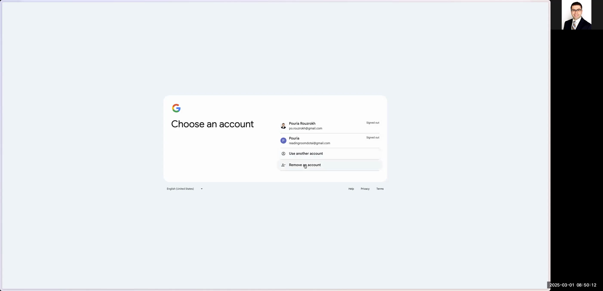

# How to Create a Google Spreadsheet for Radiographics Top 10 Articles

This guide provides a step-by-step process to automatically chart articles from Radiographics’ Top 10 Reading List into a structured Google Spreadsheet. You will learn how to navigate the Radiographics website, log into Google Drive, create and format a new spreadsheet, and import data for later processing in Python.

---

# # Overview

In this task, you'll:

1. Access and navigate the Radiographics website to find the Top 10 articles.
2. Sign into your Google Drive and create a new folder and spreadsheet.
3. Configure the Google Sheet with specific column headers and data validation dropdowns.
4. Extract and format article data for each publication.
5. Finalize the spreadsheet so it is ready for further use in your Python projects.

---

# # Step-by-Step Instructions

## # 1. Access the Radiographics Top 10 Articles Page

1. Open your web browser and type **“Radiographics top 10 articles”** in the search bar.
2. In the search results, select the link titled **“RG TEAM Top 10 Reading List”** to open the Radiographics website.
3. You should see a page listing multiple categories (e.g., Breast Imaging, Cardiac, Emergency, etc.).

```

```


## # 2. Navigate the Radiographics Website

1. Zoom in on the page if necessary to clearly view article categories.
2. Click on any category (for example, **Breast Imaging**) to view articles, organized by Resident Year (R1, R2, R3, R4, Fellows) and by difficulty level (Basic, Intermediate, Advanced).

```

```


## # 3. Log Into Google Drive

1. Open a new tab or window and go to **drive.google.com**.
2. If you are already signed in, ensure you are using the correct account. If not, sign out or use an incognito mode to log in.
3. Enter your email (for example: pioruzroj@gmail.com) and follow the prompts. Depending on your device, you might be asked to use a passkey or enter your password.

```

```



## # 4. Create a New Folder and Spreadsheet

1. In Google Drive, click the **New** button and select **Folder**.
2. Name the folder **"RG-Top10-Articles"**.
3. Open the newly created folder.
4. Within this folder, click **New** again and choose **Google Sheets** to create a blank spreadsheet.
5. Rename the spreadsheet to **"Top 10 articles"**.

```

```


## # 5. Configure the Spreadsheet Columns

1. In the Google Sheet, set up the following column headers (using the column letters as guidance):

- **A: Abstract**
- **B: Author List**
- **C: DOI** (Digital Object Identifier)
- **D: Year**
- **E: R Year** (Resident Year)
- **F: Level**

2. Format the **Level** column with data validation to create a dropdown list containing:
- Basic
- Intermediate
- Advanced

3. Apply background colors to each dropdown selection as desired (e.g., pink for Basic, green for Intermediate, blue for Advanced).

4. For the **R Year** column, apply data validation to create a dropdown menu with options:
- R1
- R2
- R3
- R4

5. Assign distinct background colors for each resident year if desired.

```

```


## # 6. Importing Data from the Radiographics Website

1. Open both the Radiographics page and the Google Sheet side by side (split screen view) for convenience.
2. For each article in a chosen category (e.g., articles for R1 Basic):
- **Abstract:** Copy the article abstract. Before pasting into the spreadsheet, paste the text into the browser's address bar to remove unwanted formatting characters, then copy it again and paste into the **Abstract** cell.
- **Author List:** Similarly, copy the author list text. Use the same trick of pasting into the address bar first to ensure no extra spaces or formatting is transferred.
- **DOI:** Copy the article's DOI link from the page and paste it in the **DOI** column.
- **Year:** Type the publication year (e.g., 2019) into the **Year** column.
- **R Year:** Using the dropdown, select the appropriate resident year (e.g., R1).
- **Level:** Using the dropdown, select the appropriate level (e.g., Basic).

```

```


3. Repeat the copy-paste process for each article across all relevant categories and resident years.

## # 7. Finalizing the Spreadsheet

1. Once all articles have been added, review the spreadsheet to ensure all cells are correctly filled and formatted.
2. Remove any unnecessary rows or columns to tidy up the spreadsheet.
3. Optionally, apply bold formatting to the header row or specific text cells for clarity.
4. Confirm that dropdown menus and color codings are correctly set up in the **Level** and **R Year** columns.

```

```

## # 8. Completion

After following all the steps and verifying your data:

- Notify yourself or the intended user that the Google Spreadsheet, now named **"Top 10 articles"**, is fully prepared and formatted.
- The spreadsheet is ready to be used and imported into your Python project for further processing.

---

# # Conclusion

This guide has walked you through every step needed to build a clean and well-structured database of Radiographics top articles using Google Sheets. By following these detailed instructions, you should be able to replicate the process easily and efficiently. Enjoy organizing your data and integrating it into your workflows!
