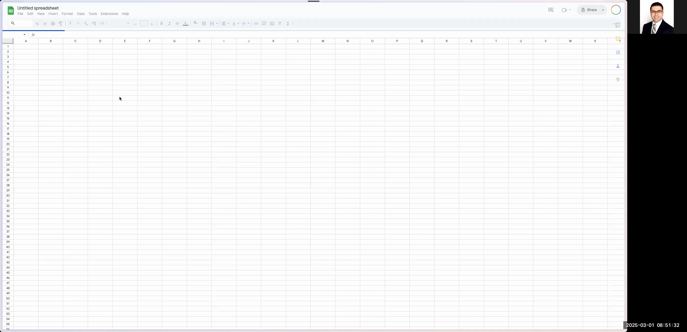

# Guide: Charting Radiographics Top 10 Articles into a Google Spreadsheet

This guide explains how to automatically chart and organize the top 10 Radiographics articles into a Google Spreadsheet. You will learn how to navigate the Radiographics website to extract details such as the article title, abstract, author list, DOI, publication year, residency year (R Year), and article level (e.g., Basic, Intermediate, Advanced). Once you have this information, you will enter it into a structured Google Sheet for later use in Python projects or other applications.

---

# # Step 1: Navigate to the Radiographics Top 10 Articles Page

1. Open your web browser.
2. In the search bar, type "Radiographics top 10 articles" and press Enter.
3. From the Google search results, click on the link titled **RG TEAM Top 10 Reading List**.

```


4. Once the page loads, you will see several categories (e.g., Breast Imaging, Cardiac, Emergency) each containing groups of articles organized by residency years (R1, R2, etc.).

---

# # Step 2: Select a Specific Category and Article

1. Zoom in on the page as needed for a clearer view of the categories.
2. Click on any category (for example, **Breast Imaging**) to reveal the available residency year lists and their corresponding articles.
3. Choose an article from one of the residency year groups (e.g., from Resident Year 1, select an article like "Digital Breast Tomosynthesis: Physics, Artifacts, and Quality Control Considerations").

```


---

# # Step 3: Sign in to Google Drive and Create a New Folder

1. Open a new browser tab and navigate to [drive.google.com](https://drive.google.com/).
2. Sign into your Google account. (Note: If you see a different login prompt or are using an alternate account, follow the onscreen instructions to log in.)

```


3. In Google Drive, create a new folder:
- Right-click on an empty area of your drive and select **New folder**.
- Name the folder `RG-Top10-Articles`.
- Click **Create**.

```


4. Open the newly created `RG-Top10-Articles` folder.

---

# # Step 4: Create and Set Up a New Google Spreadsheet

1. Within your new folder, click the **+ New** button and select **Google Sheets** → **Blank spreadsheet**.
2. Once the spreadsheet opens, rename it to `Top 10 Articles`.

```


3. Set up the table by defining the following column headers (each row will represent a single article):
- Title
- Author List
- DOI
- Year
- R Year (Residency Year)
- Level
- Abstract  

4. (Optional) Remove any extra columns (e.g., columns G to Z) to keep the spreadsheet neat.

---

# # Step 5: Configure Drop-Down Menus for the 'Level' and 'R Year' Columns

1. For the **Level** column:
- Set up a drop-down menu with the options: `Basic`, `Intermediate`, and `Advanced`.
- (Optionally) Assign different colors to each option for visual appeal.

2. For the **R Year** column:
- Set up a drop-down menu with the options: `R1`, `R2`, `R3`, and `R4`.
- (Optionally) Use bold or colored text to emphasize selections.

```




---

# # Step 6: Populate the Spreadsheet with Article Data

For each article in the Radiographics Top 10 list, follow these sub-steps:

1. **Copy the Article Title:**
- Highlight and copy the title of the selected article from the Radiographics page.
- Paste it into the `Title` column of the Google Sheet.

2. **Copy the Abstract:**
- Highlight and copy the abstract text from the article page.
- To remove any unwanted formatting or extra characters, first paste the abstract into your browser's address bar, copy it again, and then paste the clean text into the `Abstract` column.

```


3. **Copy the Author List:**
- Highlight and copy the author list from the article page.
- To ensure no extra spaces or illegal characters, paste the text into the browser's address bar first, then copy and paste the cleaned text into the `Author List` column.

4. **Extract and Enter the DOI:**
- Highlight and copy the DOI (which is a link) from the article page.
- Paste the DOI into the `DOI` column of the spreadsheet.

5. **Enter the Year:**
- Manually type the publication year (e.g., `2019`) into the `Year` column.

6. **Select the Residency Year:**
- In the `R Year` column, select the appropriate residency year from the drop-down menu (e.g., `R1`).

7. **Select the Article Level:**
- In the `Level` column, choose the appropriate level from the drop-down menu (e.g., `Basic`).

```


8. Repeat these steps for every article listed in each category (for all residency years and topics) on the Radiographics page.

---

# # Step 7: Finalize and Beautify the Spreadsheet

1. After all articles have been entered, review the spreadsheet for any extra rows or columns and delete them to maintain a clean layout.

2. Apply any additional formatting such as bolding the article titles, aligning text, and adjusting column widths to enhance readability.

3. Once satisfied, notify your users (or your future self) that the Google Spreadsheet is complete and ready for further processing (e.g., with a Python script).

```


---

# # Conclusion

You have now learned how to chart Radiographics' Top 10 Articles into a Google Spreadsheet. This automated data collection process allows for easy storage and future processing using programming tools like Python. Make sure to follow each step carefully, and adjust any formatting or dropdown settings according to your specific needs.

Happy charting!