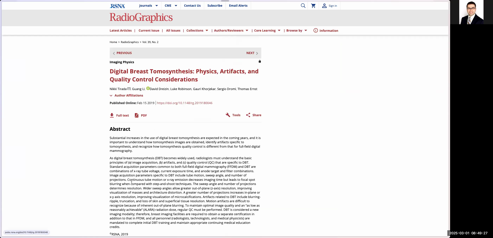
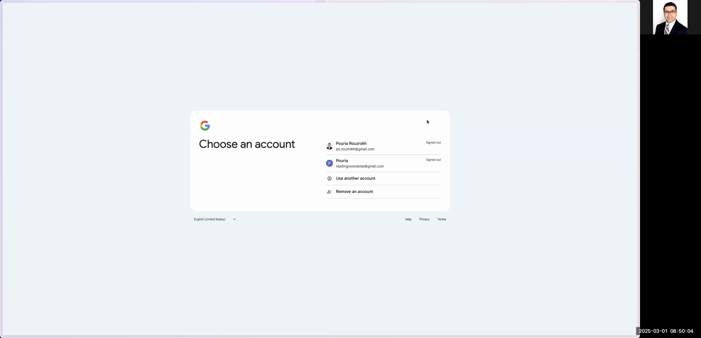
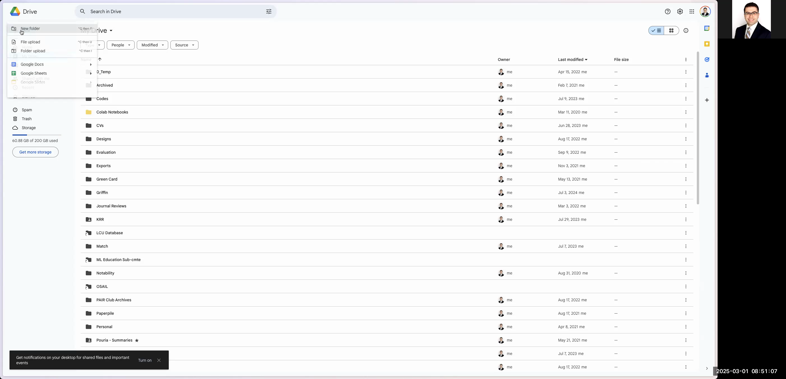
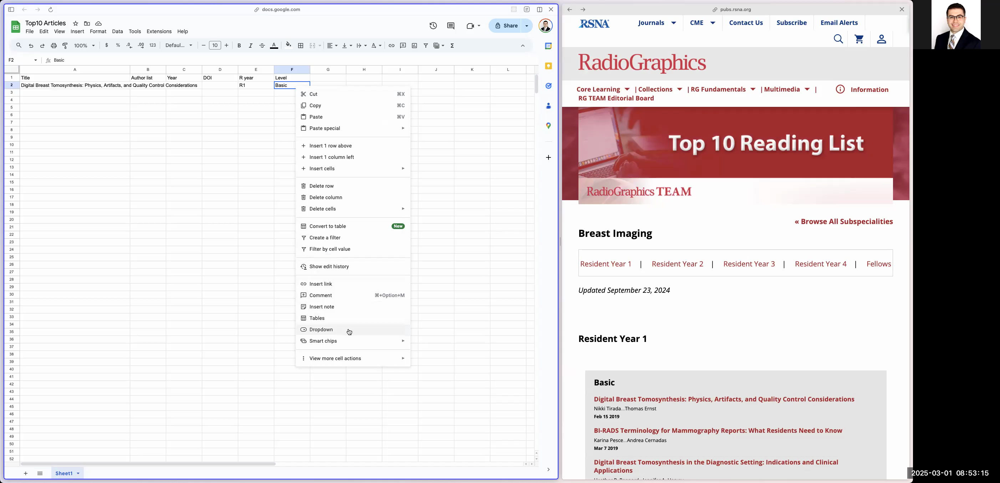

# Guide: Charting Radiographics Top 10 Articles into a Google Spreadsheet

This guide details how to chart and organize the top 10 Radiographics articles into a Google Spreadsheet. You will extract key data such as the article title, abstract, author list, DOI, publication year, residency year (R Year), and article level (e.g., Basic, Intermediate, Advanced) from the Radiographics website and input it into a neatly formatted spreadsheet for future use, such as in Python projects.

---

# # Step 1: Navigate to the Radiographics Top 10 Articles Page

1. Open your web browser.
2. In the search bar, type "Radiographics top 10 articles" and press Enter.
3. Click on the **RG TEAM Top 10 Reading List** from the search results.

```


4. Once the page loads, you will see multiple categories (e.g., Breast Imaging, Cardiac, Emergency) with articles organized by residency years (R1, R2, etc.).

---

# # Step 2: Select a Specific Category and Article

1. Zoom in as needed to clearly view the article categories.
2. Click on a category (e.g., **Breast Imaging**) to reveal its residency year groups and corresponding articles.
3. Select an article from one of the residency groups (e.g., from R1, choose "Digital Breast Tomosynthesis: Physics, Artifacts, and Quality Control Considerations").

```




4. **Returning to the Main List:** After extracting details, use your browser's back button or reopen the Radiographics Top 10 Reading List (in a new tab) to continue with the next article.

---

# # Step 3: Sign in to Google Drive and Create a New Folder

1. Open a new tab and go to [drive.google.com](https://drive.google.com/).
2. Sign in with your Google account. (For desktop browsers, follow the standard login process. Mobile interfaces might vary.)

```


3. Create a new folder:
- Right-click in an empty area and select **New folder**.
- Enter the folder name: `RG-Top10-Articles`.
- Click **Create**.

```




4. Open the newly created `RG-Top10-Articles` folder.

---

# # Step 4: Create and Set Up a New Google Spreadsheet

1. In the `RG-Top10-Articles` folder, click **+ New** and select **Google Sheets** → **Blank spreadsheet**.
2. Rename the spreadsheet to `Top 10 Articles`.
3. Create the following column headers (each row represents one article):
- Title
- Author List
- DOI
- Year
- R Year (Residency Year)
- Level
- Abstract
4. **Column Cleanup:** Delete extra columns (e.g., columns G to Z) by clicking the column header, right-clicking, and selecting **Delete column**.

---

# # Step 5: Configure Drop-Down Menus for 'Level' and 'R Year' Columns (Desktop Browser)

For desktop users, the drop-down menus are set up via Data validation:

1. Highlight the cells in the **Level** column where you want the drop-down.
2. Navigate to the menu: **Data** → **Data validation**.
3. Under Criteria, select **List of items** and enter: `Basic, Intermediate, Advanced`.
4. Click **Save**. (Optionally, use cell formatting to assign colors.)

5. Repeat the process for the **R Year** column with options: `R1, R2, R3, R4`.

```


---

# # Step 6: Populate the Spreadsheet with Article Data

For each article, complete the following:

1. **Copy the Article Title:**
- Highlight and copy the title from the article page.
- Paste it into the `Title` column.

2. **Extract and Clean the Abstract:**
- Copy the abstract text from the article page.
- **Cleaning Rationale:** The copied abstract may include unwanted HTML tags, extra line breaks, or formatting artifacts. For example, the text might initially appear as:

```


<p>Digital Breast Tomosynthesis:</p>
<p>Physics, Artifacts, and Quality Control Considerations</p>
```

- Cleaned text should be:

```
Digital Breast Tomosynthesis: Physics, Artifacts, and Quality Control Considerations
```

- To clean it, paste the copied text into your browser's address bar or a plain text editor (e.g., Notepad) to remove formatting, then re-copy and paste into the `Abstract` column.

3. **Copy and Clean the Author List:**
- Copy the author list from the article page.
- Clean using the same method (address bar or a plain text editor) to remove extra spaces and unwanted characters, then paste into the `Author List` column.

4. **Enter the DOI:**
- Copy the DOI (hyperlink) from the article page and paste it into the `DOI` column. It should remain clickable if formatted as a hyperlink.

5. **Enter the Year:**
- Type in the publication year (e.g., `2019`) in the `Year` column. 
- **Note:** If an article does not explicitly list a publication year, check the DOI (for example, a DOI like `10.1148/rg.202019` implies the year is 2019) or estimate from context.

6. **Select the Residency Year:**
- Use the drop-down in the `R Year` column to select the appropriate residency (e.g., `R1`).

7. **Select the Article Level:**
- Use the drop-down in the **Level** column to choose the proper level (e.g., `Basic`).

```


8. Repeat these steps for each article on the Radiographics Top 10 list.

---

# # Step 7: Finalize and Beautify the Spreadsheet

1. Review the spreadsheet to remove any extra rows or columns. Delete extra columns by right-clicking on the header and selecting **Delete column**.
2. Format the spreadsheet to enhance readability:
- Bold the header row.
- Adjust column widths so that all data is clearly visible.
- Ensure all cells are consistently formatted and, where necessary, text is not unnecessarily wrapped (or is wrapped appropriately).

```


3. Once the spreadsheet is complete, notify your team (or yourself) that it is ready for further processing with your Python scripts or other applications.

---

# # Conclusion

You have successfully charted Radiographics' Top 10 Articles into a Google Spreadsheet. This guide covers navigating the website, cleaning and extracting data, setting up dropdowns, and finalizing the spreadsheet. By following these detailed steps and using the provided visual guides, you ensure accurate and consistent data collection for your projects.

Happy charting!