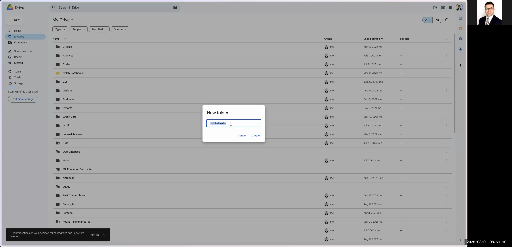
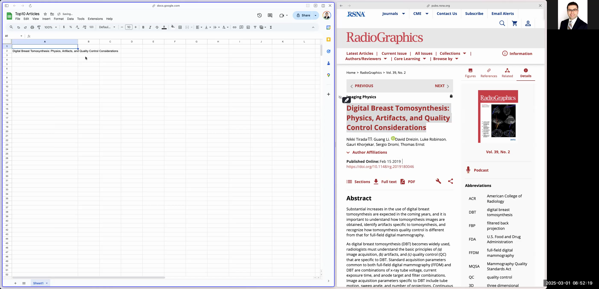

# Automate Charting of Radiographics Top 10 Articles in Google Sheets

This guide explains how to automatically chart all articles from Radiographics' Top 10 reading list into a Google Sheet. You will learn to navigate the Radiographics website, extract article details (such as title, author list, DOI, year, residency year, level, abstract, etc.), and organize the information into a well-formatted Google Spreadsheet. This spreadsheet can later be imported into your Python programs for further processing.

---

# # Step-by-Step Instructions

## # 1. Open the Radiographics Top 10 Articles Page

1. Open your preferred web browser.
2. In the search bar, type **"Radiographics top 10 articles"**.
3. Select the search suggestion or click on the first result titled **"RG TEAM Top 10 reading list"**.
4. The Radiographics page will load showing various article categories (e.g., Breast Imaging, Cardiac).

```


```


## # 2. Explore and Select an Article Category

1. On the Radiographics page, observe the different categories of articles (e.g., Breast Imaging, Cardiac, Emergency, etc.).
2. Click on any single category (for example, **Breast Imaging**) to view the list of articles sorted by residency years (e.g., R1, R2, etc.).
3. Zoom in if necessary to clearly view the article titles and categories.

```


```


## # 3. Log Into Google Drive

1. Open a new browser tab and type **drive.google.com** in the address bar.
2. If you are not already logged in, you may need to click on the **"Use another account"** button.
3. Enter the appropriate email address (for example, `pioruzroj@gmail.com` if following the demo) and complete the login process using your own passkey or password.
4. Follow any additional prompts required by Google Drive based on your device.

```


```


## # 4. Create a New Folder and a Google Spreadsheet

1. Once in Google Drive, click the **"New"** button and select **"Folder"**.
2. Name the folder **"rg-top10-articles"**.
3. Open the newly created folder.
4. Inside the folder, click the **"New"** button again and select **"Google Sheet"** to create a blank spreadsheet.
5. Name the spreadsheet **"top10-articles"**.

```


```



```


```


## # 5. Set Up the Google Spreadsheet

1. In your spreadsheet, prepare the columns to store the article data. Create the following headers in the first row:
- Title
- Author List
- DOI
- Year
- R Year (Residency Year)
- Level (e.g., Basic, Intermediate, Advanced)
- Abstract

2. Optionally, format the header row (for example, bold the text) to make it visually distinct.
3. Consider enabling text wrapping for cells that will include longer text like abstracts. However, as shown in the video, for the abstract column, text is kept unwrapped to avoid excessive line breaks.

```


```



## # 6. Populate the Spreadsheet with Article Data

For each article in the selected category, perform the following steps:

1. **Extract Article Details**:
- Click on an article title to open its page.
- Copy the article title (this will go into the **Title** column).
- Extract the author list and copy it into a text editor (or the browser’s address bar) to remove any extraneous characters, then paste into the **Author List** column.
- Locate and copy the DOI (the DOI is a link). Paste it directly.
- Identify the publication year (e.g., 2019) and enter it into the **Year** column.
- Determine the residency year (e.g., R1, R2, etc.) and enter it into the **R Year** column. Use a drop-down menu if desired (modify data validation accordingly in your spreadsheet).
- For the article level (e.g., Basic, Intermediate, Advanced), use a drop-down menu to ensure consistent formatting. Optionally, apply colors to each category for visual differentiation.
- Copy the abstract text. If the abstract includes unnecessary characters or extra spaces, paste it first into the browser's address bar (or a plain text editor) to clean it up before pasting it into the **Abstract** column.

2. **Paste the Data into Your Spreadsheet**:
- Paste each piece of data into its corresponding column (Title, Author List, DOI, Year, R Year, Level, Abstract) in a new row.
- Make any final adjustments such as removing extra spaces or unwanted row content.

```


```

3. **Repeat for Each Article**:
- Go back to the Radiographics article list and repeat the extraction and pasting process for every article in the category.
- If necessary, adjust drop-down selections for the residency year and article level as you process different articles.

## # 7. Finalize and Beautify the Spreadsheet

1. Once all articles for a category (or all categories) have been processed, scroll through your Google Sheet to verify accuracy.
2. Delete any extra rows that are not needed.
3. Apply formatting changes such as bolding titles or color-coding cells to enhance readability and visual appeal.
4. Notify yourself (or your users) that the spreadsheet is complete and ready for use in your Python project or analysis.

```


```

---

# # Final Notes

- If you encounter any text formatting issues (e.g., extra spaces in the abstract), copying and pasting through the browser's address bar or a plain-text editor can help clean the text before pasting it into your spreadsheet.
- The use of drop-down menus for both the residency year and article level helps maintain consistency across data entries. Configure these using Google Sheet's data validation options.
- Depending on your Google Drive login settings and device, the login process may vary slightly. Follow on-screen instructions as required.

This guide provides a clear framework to automate the charting of articles from the Radiographics Top 10 reading list into a Google Sheet, ready for further processing with Python or other tools.

Happy charting!