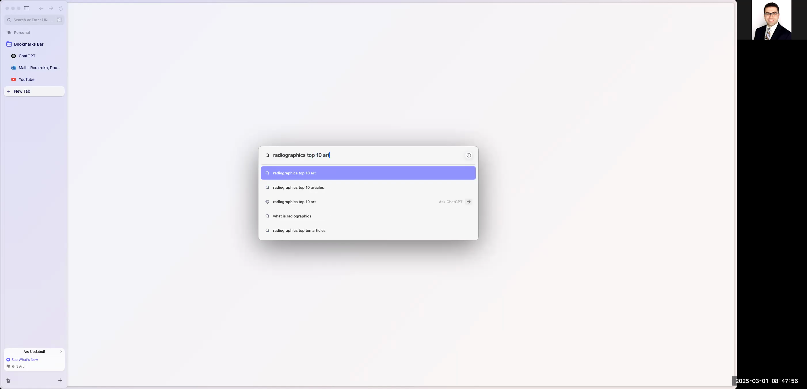
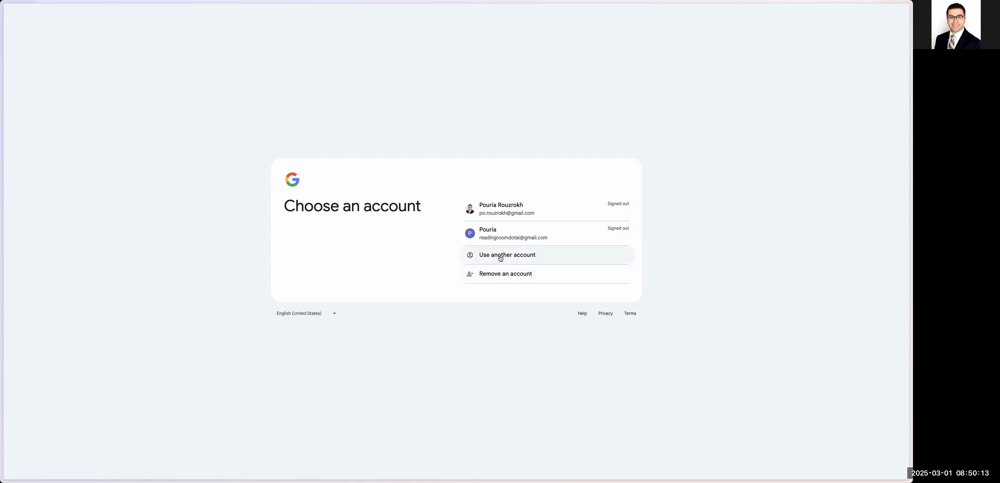
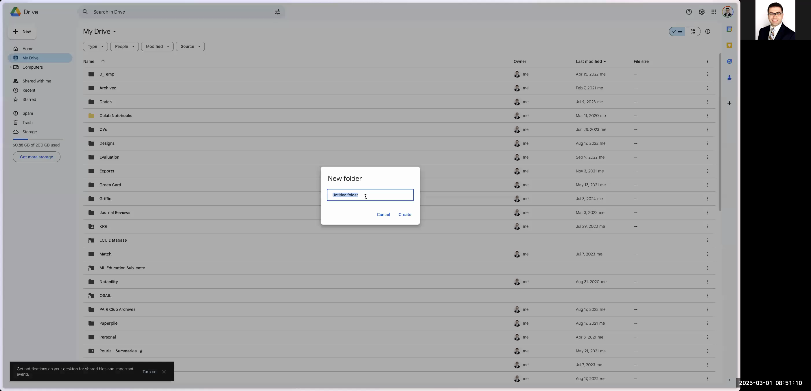
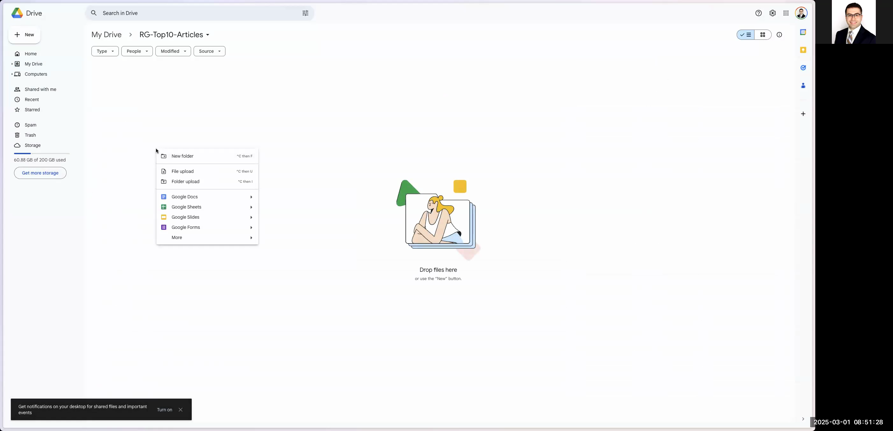

# Automate Charting of Radiographics Top 10 Articles into Google Sheets

This guide explains how to automatically chart all articles from Radiographics' Top 10 reading list into a Google Sheet. You will learn how to navigate the Radiographics website, extract article details (such as title, author list, DOI, year, residency year, level, abstract, etc.), and organize this information into a well-formatted Google Spreadsheet. The finished spreadsheet can later be imported into your Python programs or used for further data analysis.

---

# # Step-by-Step Instructions

## # 1. Open the Radiographics Top 10 Articles Page

1. Open your preferred web browser.
2. In the search bar, type **"Radiographics top 10 articles"**.
3. Select the search suggestion or click on the first result titled **"RG TEAM Top 10 reading list"**.
4. The Radiographics webpage will load, displaying various article categories (e.g., Breast Imaging, Cardiac, Emergency, etc.).

```

```



---

## # 2. Explore and Select Article Categories

1. On the Radiographics page, review the list of categories. Each category represents different knowledge areas and residency level articles.
2. Click a category (for example, **Breast Imaging**) to view the list of articles sorted by residency years (e.g., R1, R2, etc.).
3. **Repeat for Multiple Categories:** If you wish to chart articles from several categories, perform the following:
- After processing one category, navigate back to the main categories page.
- Select the next category (e.g., Cardiac) and repeat the extraction process for its articles.
- Continue until all desired categories are processed.

```

```


---

## # 3. Log Into Google Drive

1. Open a new browser tab and navigate to **drive.google.com**.
2. If you are not already logged in, click **"Use another account"**.
3. Enter your work or personal email address (e.g., you@example.com) to sign in.
4. Complete the login process using your own passkey or password. Follow any additional on-screen instructions provided by Google.

```

```



---

## # 4. Create a New Folder and a Google Spreadsheet

1. In Google Drive, click the **"New"** button and select **"Folder"**.
2. Name the folder **"rg-top10-articles"**.
3. Open the newly created folder.
4. Inside the folder, click **"New"** and select **"Google Sheet"** to create a blank spreadsheet.
5. Name the spreadsheet **"top10-articles"**.

```

```



```

```



---

## # 5. Set Up the Google Spreadsheet

1. Open the spreadsheet and prepare the columns to store your article data. In row 1, create the following headers:
- Title
- Author List
- DOI
- Year
- R Year (Residency Year)
- Level (e.g., Basic, Intermediate, Advanced)
- Abstract

2. Format the header row (e.g., bold the text) so that it stands out.
3. Configure the cells for consistent text formatting:
- **Text Wrapping:** Select cells that will contain longer text (like Abstract), click on the text wrap button in the toolbar, and choose "Overflow" or "Clip" as preferred. In this scenario, it is recommended to keep the Abstract unwrapped to avoid unwanted line breaks.
4. **Set Up Data Validation (Dropdown Menus):** Use data validation to enforce consistent input for the R Year and Level columns:
- For **R Year:**
1. Select the column cells where the residency year will be entered (for example, column E starting from row 2).
2. Go to **Data** > **Data Validation**.
3. Under **Criteria**, choose "List of items" and enter: `R1,R2,R3,R4`.
4. Click **Save**.
- For **Level:**
1. Select the appropriate column cells (for example, column F starting from row 2).
2. Go to **Data** > **Data Validation**.
3. Under **Criteria**, choose "List of items" and enter: `Basic,Intermediate,Advanced`.
4. Click **Save**.

```

```


---

## # 6. Populate the Spreadsheet with Article Data

For each article (across all selected categories), complete the following steps:

1. **Extract Article Details from the Radiographics Website:**
- Click on an article title to view its details.
- **Title:** Copy the article title and paste it into the **Title** column of your sheet.
- **Author List:** Copy the author list. To clean the text:
1. Paste the copied text into your browser's address bar or a plain text editor.
2. Re-copy the cleaned text, which removes any unwanted line breaks or extra characters.
3. Paste it into the **Author List** column.
- **DOI:** Locate the DOI (often a clickable link) and copy it into the **DOI** column.
- **Year:** Manually enter the publication year (e.g., 2019) into the **Year** column.
- **R Year:** Select the appropriate residency year (e.g., R1) from your dropdown menu in the **R Year** column.
- **Level:** Choose the article level (e.g., Basic, Intermediate, Advanced) from the dropdown in the **Level** column.
- **Abstract:** Copy the abstract text and perform a cleaning step if needed:
1. If the abstract contains unwanted spaces or extra line breaks, paste the text into your browser's address bar or a text editor.
2. Copy it again to remove formatting issues and paste it into the **Abstract** column.

2. **Repeat:** Repeat these steps for every article in the current category. Then, navigate back to process articles from additional categories as described in Step 2.

*Note:* Ensure that every new article is entered in a new row. Manually adjust or delete any extra rows if they are created inadvertently.

---

## # 7. Finalize and Beautify the Spreadsheet

1. Once all articles have been processed, review the spreadsheet to ensure all information is accurately presented.
2. Remove any unused rows to keep the sheet tidy.
3. Optionally, apply additional formatting such as bolding titles or color-coding rows to enhance readability.
4. Confirm that all dropdown menus and text wrapping settings are functioning as intended.

---

# # Final Notes

- **Handling Multiple Categories:** This guide covers processing one category at a time. If you are charting data from multiple categories, remember to repeat Steps 2 and 6 for each category.
- **Data Cleaning:** When copying text (especially for the Author List and Abstract), pasting it into a plain-text environment (like the browser's address bar) helps eliminate unwanted formatting and extra spaces.
- **Data Validation:** Using dropdown menus for residency year and article level ensures consistent data entry and simplifies later processing in any automated systems.
- **Customization:** Adjust column widths, text wrapping, and colors to suit your preferences and improve dataset clarity.

This comprehensive guide is designed to allow you to create a clean, accurate, and visually appealing record of Radiographics Top 10 articles in a Google Sheet, ready for subsequent analysis or further automation with tools like Python.

Happy charting!